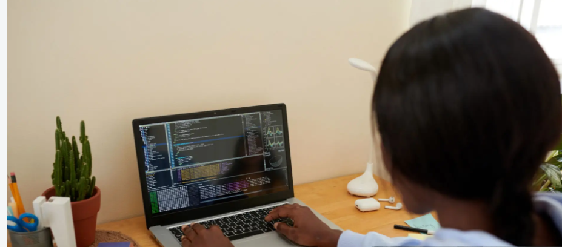

This is my personal portfolio website,created to showcase my skills,projects,and contact information.
It includes the following features:
`Home`-Introduction and brief description about me.
`About`-My educational background and why i chose programming.
`Projects`-a list of my projects with screenshots and description.
```
html
<!DOCTYPE html>
<html lang="en">
<head>
    <meta charset="UTF-8">
    <meta name="viewport" content="width=device-width, initial-scale=1.0">
    <title>Portfolio project</title>
    <link rel="stylesheet" href="style.css">
</head>
<body>
    <!-- Home section -->
      
   <h1>Joyce </h1> 
   <h2>Home</h2>
   <p class="p">Hello! I am an aspiring software developer with a curious mind and a love for creativity.I enjoy exploring new technologies and building solutions that make life easier.
      I am a motivated learner in software development focusing on mastering the fundamentals and growing my ability to design practical,user-friendly projects.
   </p>
   
   
   
<!-- About section -->

   <h2>About</h2>
   <p class="p">I am a high school graduate currently pursuing software engineering at Moringa. My educational  background has shaped me to be curious, adaptable,and commited to continous learning.
    While my background is not strictly technical,my experiences in school have taught me discipline,problem solving,and how to approach challenges with creativity and resilience.
    I choose to pursue programming because I believe technology is one of the most powerful tools for creating opportunities and solving real-life problems.
   </p>
   
   <!-- skills section -->
   
   <h2>Skills</h2>
   <p class="p">
    <h3>Technical Skills</h3>
    <ul>
   <li>Programming Fundamentals</li>
   <li>Version Control</li>
   <li>Problem Solving</li>
    </ul>
    <h3>Non Technical Skills</h3>
    <ul>
   <li>Creativity</li>
   <li>Time Management</li>
    </ul>
  </p>
  
  <!-- Projects section -->
   
   <h2>Projects</h2>
   <ul>
   <li>Restaurant menu
     <ol>
        <li>HTML</li>
        <li>CSS</li>
     </ol>
   </li>
   
   

   <p class="p">Some of the foods sold in Bite and Sip restaurant</p>
   <li>Profile page
     <ol>
       <li>HTML</li>
       <li>CSS</li>
     </ol>
    </li>
     
    </ul>
    
<!-- contact section -->
  
<h2>Contact</h2>
<p>Name:Joyce Njogu</p><br>

<p>Email:<a href="mailto:joycenjogu127@gmail.com">joycenjogu127@gmail.com</a></p>

<p>Phone:<a href="tel:+254768966486">+254768966486</a></p>

    <form>
<input type="text" placeholder="Joyce">
<button type="submit">Submit</button>
    </form>
    
</body>
</html>
```